# ChatGPT Comfy Connector

**ChatGPTと相談しながら、ComfyUIで画像・動画を作るためのWindowsアプリです。**

使用するWorkflowとChatGPTの会話を選び、制作を開始すると、生成結果をChatGPTへ渡して次の改善につなげられます。このREADMEでは、v0.2 Alphaの画面に沿って操作方法を説明します。

[初回の準備](#setup) · [制作を始める](#create) · [結果を見る](#output) · [続行・終了](#continue) · [Workflowの編集](#workflow) · [困ったとき](#help)

普段の操作は、**CONNECT → Workflowを選択 → Project / Chatを確認 → 新しい制作を開始 → SEND TO CHATGPT**です。初めて使う場合は、先に[初回の準備](#setup)を行ってください。

<a id="screen"></a>

## 画面の見方

[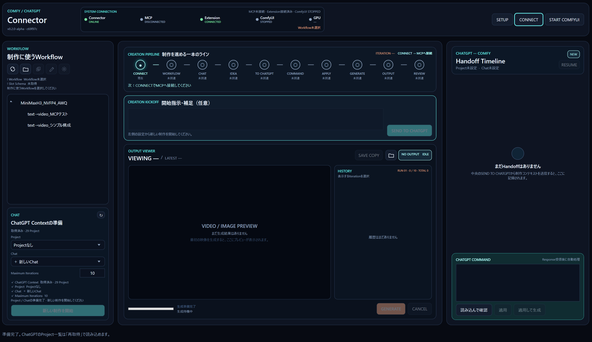](docs/images/manual/overview.png)

各画像はクリックすると拡大できます。画像内のWorkflow名、Project / Chat、パスは一例です。

| 画面の場所 | 名前 | できること |
|---|---|---|
| 上部 | SYSTEM CONNECTION | MCP・拡張機能・ComfyUIなどの接続状態を確認する |
| 左上 | WORKFLOW | 使用するWorkflowを選ぶ・複製する・設定を開く |
| 左下 | CHAT | ChatGPTのProject / Chat、最大反復回数を設定する |
| 中央上 | CREATION PIPELINE | 制作がどの段階にあるか、次に何をするかを確認する |
| 中央 | CREATION KICKOFF | ChatGPTへの開始指示・補足を入力して送信する |
| 中央下 | OUTPUT VIEWER / HISTORY | 生成結果を見比べる・再生する・コピー保存する |
| 右側 | Handoff Timeline | ChatGPTとの送受信履歴を確認する |
| 右下 | CHATGPT COMMAND | 必要なときにResponseを手動で読み込み、適用する |

次に操作するボタンや欄は、**枠の点滅**とパイプライン下の「次：…」で案内されます。処理中は案内の点滅が止まり、入力中や選択中は枠の常時強調になります。Windowsでアニメーションを無効にしている場合も、枠の常時強調で案内します。

<details>
<summary>画面に出てくる用語</summary>

| 用語 | 意味 |
|---|---|
| Workflow | ComfyUIで実行する処理手順をまとめたJSONファイル |
| Slot / Slot Schema | Connectorから変更できる項目と、その型・範囲などの情報 |
| Project / Chat | 制作に使用するChatGPTのProjectと会話 |
| Session | Workflow・会話・生成履歴をまとめた、ひとつの制作単位 |
| Iteration | 制作の反復。生成を進めるたびに履歴へ記録される |
| Run | 最大反復回数を数える区切り。RESUMEで新しいRunとして続行できる |
| Handoff | ConnectorからChatGPTへ渡す制作指示や生成結果の情報 |
| Response / Command | ChatGPTから返される、次の生成や制作完了の指示 |

</details>

<a id="setup"></a>

## 1. 初回の準備

### 用意するもの

- Windowsの64bit環境。
- 使用するモデル・Custom Nodeを導入し、Workflowを実行できる状態のComfyUI Portable。
- `comfy-mcp.exe`。設定時に保存場所を指定します。
- ChromeまたはEdgeと、ログイン済みのChatGPT。
- Connector本体と、コレクタ（ブラウザー拡張機能）の配布ZIP。

本体とコレクタは、それぞれ[GitHub Releases](https://github.com/Lye-0/chatgpt-comfy-connector/releases)から取得します。本体ZIPには、アプリの実行に必要な.NETランタイムが含まれます。ComfyUI本体、モデル、Custom Node、comfy-mcpは別途用意してください。

| ダウンロードするもの | リリースのタグ | Assetsから選ぶファイル |
|---|---|---|
| Connector本体 | `desktop-v`で始まるタグ | `ChatGPT-Comfy-Connector-v…-win-x64.zip` |
| コレクタ | `collector-v`で始まるタグ | `ChatGPT-Comfy-Collector-v….zip` |

### アプリを起動する

1. [リリース一覧](https://github.com/Lye-0/chatgpt-comfy-connector/releases)で`desktop-v`から始まるリリースを開き、Assetsの`ChatGPT-Comfy-Connector-v…-win-x64.zip`を取得します。
2. ZIPを、書き込み可能なフォルダーへ**すべて展開**します。
3. 展開先の`ChatGPTComfyConnector.Desktop.exe`を起動します。

実行ファイルは、同梱のDLLやフォルダーと一緒に置いて使います。ソースコードから起動する場合は、末尾の[開発者向け情報](#development)を参照してください。

### 接続先を設定する

初回に開く設定画面、または上部の **SETUP** から設定します。

| 項目 | 入力する内容 | 入力例 |
|---|---|---|
| ComfyUI Portableの場所 | `ComfyUI`フォルダーが入っているPortableの親フォルダー | `C:\AI\ComfyUI_windows_portable` |
| comfy-mcpの実行ファイル | `comfy-mcp.exe`のフルパス | `C:\AI\comfy-mcp-runtime\.venv\Scripts\comfy-mcp.exe` |
| 接続先Endpoint | ComfyUIの接続先URL | `http://127.0.0.1:8188` |
| 最大反復回数 | 新しい制作に使う既定の上限。1〜1000で指定 | `10` |

「主要パス」に表示されたWorkflow・Output・Videoの保存先を確認して、**設定を保存**を押します。変更を取り消す場合は、右上の **×** を押してください。保存せずに閉じ、設定画面を開く前の値へ戻ります。

<a href="docs/images/manual/connection-settings.png">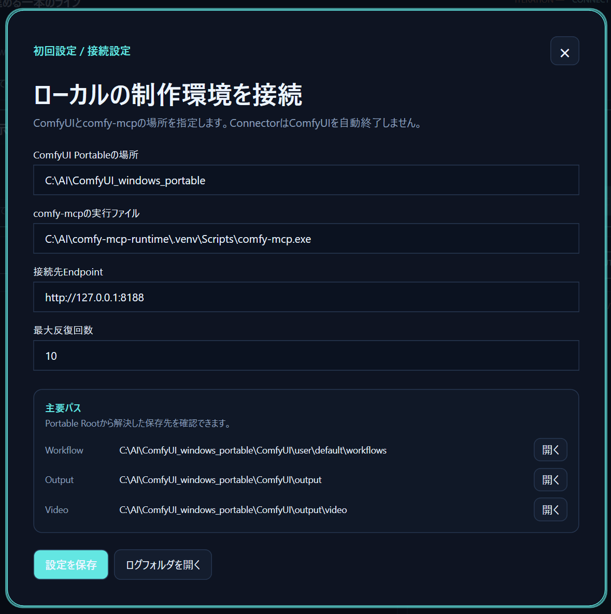</a>

<details>
<summary>ComfyUIの起動方法について</summary>

通常の生成では、ConnectorがComfyUIの起動状態を確認します。停止していれば、設定したPortableフォルダーの`run_nvidia_gpu.bat`を実行して起動を待ちます。

上部の **START COMFYUI** で手動起動することもできます。別の方法でComfyUIを起動する環境では、先にComfyUIを起動し、設定したEndpointへ接続できる状態にしてください。

</details>

### コレクタを導入・接続する

1. [リリース一覧](https://github.com/Lye-0/chatgpt-comfy-connector/releases)で`collector-v`から始まるリリースを開き、Assetsの`ChatGPT-Comfy-Collector-v….zip`を取得します。
2. ZIPの中身を、継続して使うフォルダー（例：`C:\AI\ChatGPT-Comfy-Collector`）へ**すべて展開**します。
3. Connectorを起動したまま、Edgeなら`edge://extensions`、Chromeなら`chrome://extensions`を開きます。
4. **開発者モード／デベロッパーモード**をオンにします。
5. Edgeの **展開して読み込み**、またはChromeの **パッケージ化されていない拡張機能を読み込む** を押し、展開先の **`manifest.json`が入っているフォルダー** を選びます。
6. **ChatGPT Comfy Collector** のポップアップを開き、Connector上部の **PAIRING CODE**、または **SETUP → 拡張機能の接続** に表示されたコードを入力して **PAIR DESKTOP** を押します。
7. コレクタの表示と、Connector上部の **Extension** が **CONNECTED** になることを確認します。

**利用中は開発者モードをオンにし、読み込んだフォルダーをその場所に保持してください。** 更新時も同じフォルダーを使います。詳しい導入・更新手順は[コレクタのREADME](browser-extension/README.md)を参照してください。

初回のペアリング後は接続情報が保存されます。次回起動時に接続が戻らない場合は、拡張機能のポップアップにある **CONNECT** を押してください。**PING** は通信確認に使えます。

[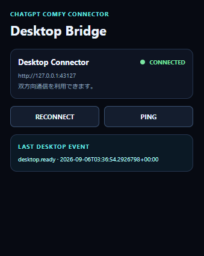](docs/images/manual/extension-connected.png)

接続済みのポップアップでは **CONNECTED** と表示され、接続ボタンは **RECONNECT** に変わります。

| CONNECTボタンの場所 | 接続するもの |
|---|---|
| Connector本体の上部 | comfy-mcpとの接続 |
| 拡張機能のポップアップ | ブラウザー拡張機能とConnectorの接続 |

<details>
<summary>コレクタの更新・再インストール後に接続し直す</summary>

通常の更新では、制作を停止して新しいZIPの中身を**同じフォルダーへ上書き**し、拡張機能管理画面で **再読み込み** を押します。保存済みのペアリング情報を使って接続します。

再インストールやフォルダー変更などで接続情報を引き継げなかった場合は、次の手順で接続し直します。

1. 使用しない古い拡張機能を無効にし、接続したい拡張機能を有効にします。
2. Connectorの **SETUP** を開き、下へスクロールして **拡張機能を再ペアリング** を押します。
3. 同じ画面に表示された **ペアリングコード** を **コピー** します。
4. 接続したい拡張機能のポップアップへコードを貼り付け、**PAIR DESKTOP** を押します。
5. Connectorと拡張機能が **CONNECTED** になったことを確認します。

コードの有効期限は発行から10分です。期限が切れた場合も、同じボタンで新しいコードを発行できます。

**再ペアリングはボタンを押すとすぐに反映されます。** 古い接続情報は無効になり、「設定を保存」や右上の×では取り消せません。制作履歴、Workflow、生成ファイル、接続先の設定は保持されます。

制作や送受信の処理中はボタンを押せません。制作を止める場合は、SETUPを閉じて **CANCEL** で停止してください。Project / Chatの取得中は、取得処理が終わるまで待ちます。

</details>

<details>
<summary>ChatGPTの専用ウィンドウが開いたとき</summary>

Connectorは、Project / Chatの一覧を取得するウィンドウと、制作指示・生成結果を送るウィンドウを使います。送信先は、制作開始時に選んだProject / Chatです。

一覧取得や送信の途中は、それらのウィンドウの読み込み完了を待ってください。普段使っているブラウザーの別タブを前面にしても、制作の送信先は切り替わりません。

</details>

<a id="create"></a>

## 2. 制作を始める

### ① CONNECTを押す

Connector上部の **CONNECT** を押します。パイプラインの **CONNECT** が完了になれば、Workflowを準備できます。

この時点では、ComfyUIが停止中でも構いません。ComfyUIの起動確認は、生成が必要になったときに行われます。

### ② Workflowを選ぶ

左側の **WORKFLOW** から、使用するWorkflowを選びます。Connectorが編集可能な項目を読み込み、**Slot Schemaの取得が完了するまで待ちます**。

一覧は、設定したPortableフォルダーの`ComfyUI\user\default\workflows`から読み込まれます。追加したWorkflowが見つからない場合は、Workflow一覧の **↻** を押してください。

[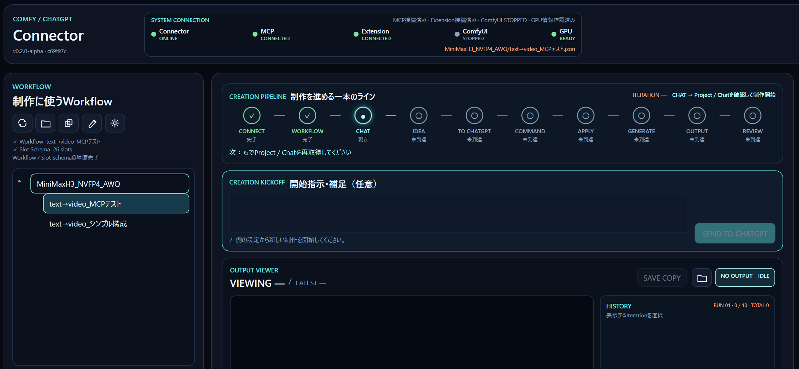](docs/images/manual/workflow-selected.png)

### ③ Project / Chatを再取得して選ぶ

1. 左下の **CHAT** にある **↻** を押します。
2. 再取得中は、Project・Chat両方のプルダウンに **「プロジェクトを取得中…」** と表示されます。完了まで待ちます。
3. **Project** を開き、制作に使うProjectを選択・確認します。
4. そのProjectのChat取得が終わったら、**Chat** を選択・確認します。
5. **Maximum Iterations** を確認します。

すでに目的の項目が選ばれている場合も、プルダウンを開いて現在の選択を確認できます。同じ項目のまま確定しても、次の案内へ進みます。

[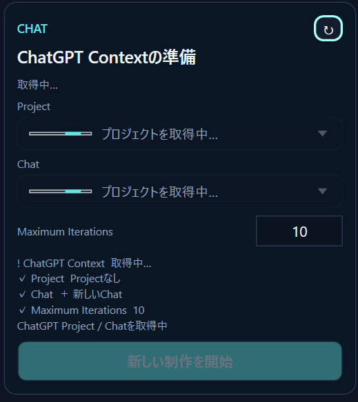](docs/images/manual/chat-loading.png)

| 選択項目 | 使い方 |
|---|---|
| 通常のProject | そのProject内の会話を使う |
| Projectなし | Projectに属さない会話を使う |
| 既存のChat | これまで相談した内容を制作に活かす |
| ＋ 新しいChat | 送信時に新しい会話を始める |
| Maximum Iterations | 続行を選ぶまでに進める最大反復回数。1〜1000で指定する |

### ④「新しい制作を開始」を押す

Workflow、Project、Chat、Maximum Iterationsが揃ったら、**新しい制作を開始**を押します。

選択内容が制作Sessionに登録され、中央の開始指示欄が使えるようになります。右側の **Handoff Timeline** に表示されたProject / Chatも確認してください。

[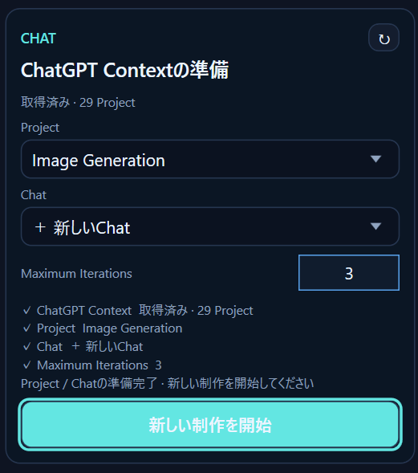](docs/images/manual/chat-ready.png)

<details>
<summary>制作中にWorkflowやProject / Chatを変更したい</summary>

選択欄を変更しただけでは、進行中の制作の送信先は切り替わりません。

必要な項目を選び直して **新しい制作を開始** を押すと、現在の制作と選択が異なる場合は確認画面が出ます。

| 選択 | 動作 |
|---|---|
| Yes | 現在のSessionへ設定を反映する。生成履歴を保持し、Handoffは新しい設定で準備し直す |
| No | 別の新しい制作を開始する |
| Cancel | 現在の制作を維持する |

生成中は、新しい制作の開始や設定の切り替えを待ってください。

</details>

### ⑤ 開始指示を送る

中央の **CREATION KICKOFF／開始指示・補足（任意）** に、必要なら今回の指示を書きます。

```text
これまで相談した夜の街の映像を、まず短い尺で試してください。
カメラの動きはゆっくりにして、生成結果を見ながら調整してください。
```

**空欄でも開始できます。** 空欄の場合は、選んだChatGPTの会話内容をもとに制作を進めます。新しいChatを使う場合は、何を作りたいかを書いておくと意図を伝えやすくなります。

準備ができたら **SEND TO CHATGPT** を押します。

[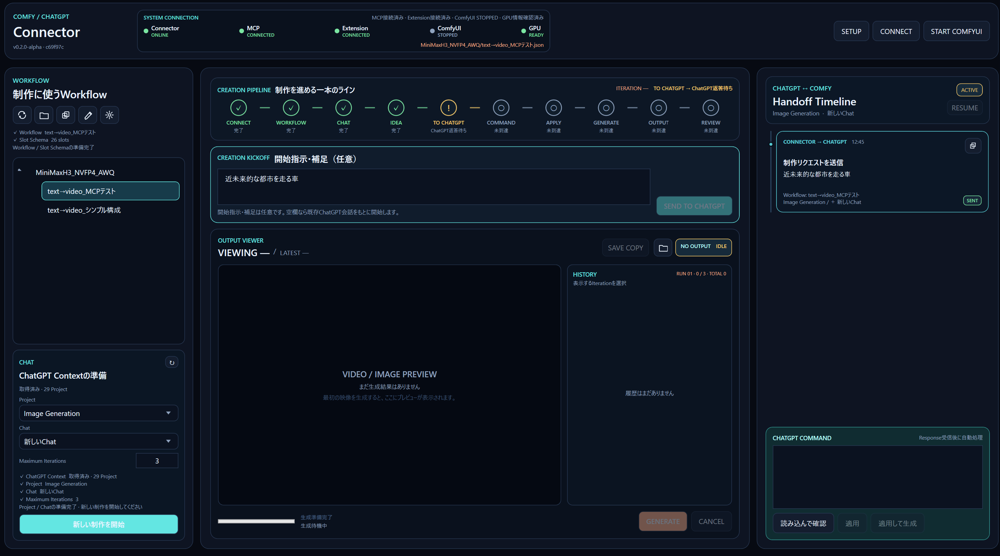](docs/images/manual/kickoff-sent.png)

送信直後の例です。Handoff Timelineに **SENT** が表示され、パイプラインは **ChatGPT返答待ち** になります。

拡張機能が接続されている通常の流れでは、送信後に次の処理が自動で進みます。

1. ChatGPTから、次の生成指示を受け取る。
2. Connectorが指示を確認し、Workflowへ反映する。
3. ComfyUIで生成し、結果を履歴へ登録する。
4. 代表の生成結果を同じChatGPTの会話へ添付し、レビューを依頼する。
5. ChatGPTの判断に応じて次の生成へ進む、または制作を完了する。

自動処理中は、パイプラインと状態表示を見て待ちます。手動操作が必要になった場合は、枠と「次：…」の案内に従ってください。

<details>
<summary>パイプラインの各段階で何が起きるか</summary>

```text
CONNECT → WORKFLOW → CHAT → IDEA → TO CHATGPT
        → COMMAND → APPLY → GENERATE → OUTPUT → REVIEW
```

| 段階 | 内容 |
|---|---|
| CONNECT | MCPへ接続する |
| WORKFLOW | Workflowを選び、Slot Schemaを取得する |
| CHAT | Project / Chatを取得・選択し、制作を開始する |
| IDEA | 任意の開始指示・補足を準備する |
| TO CHATGPT | ChatGPTへ制作情報を送る |
| COMMAND | ChatGPTの指示を読み込み、内容を検証する |
| APPLY | バックアップを作り、変更を反映・検証する |
| GENERATE | ComfyUIで生成する |
| OUTPUT | 生成結果を取得して履歴へ登録する |
| REVIEW | ChatGPTに結果の確認・改善判断を依頼する |

レビューで次の生成が決まると、同じ制作の中でCOMMAND以降を繰り返します。

[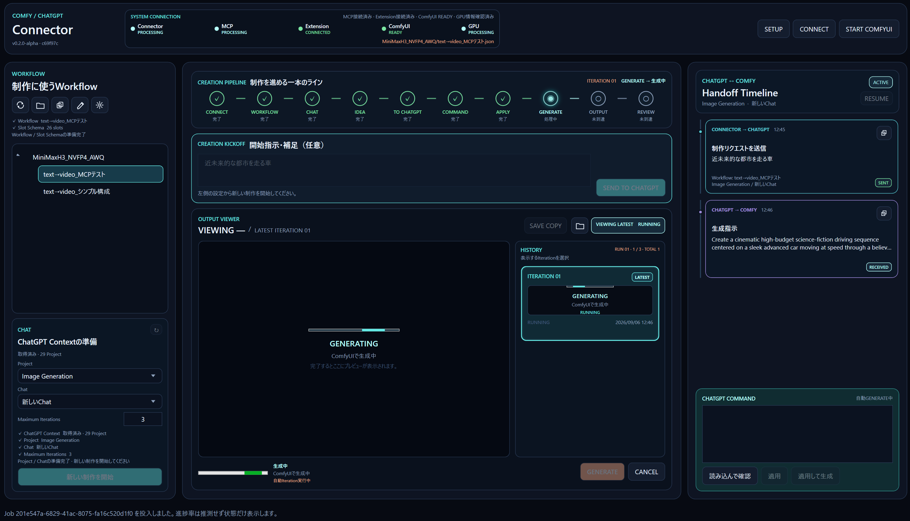](docs/images/manual/generation-running.png)

自動で生成が始まった例です。パイプラインの **GENERATE** が処理中になり、中央に **GENERATING**、右側に受信した生成指示が表示されます。

</details>

<a id="output"></a>

## 3. 生成結果を見る・保存する

生成結果は中央の **OUTPUT VIEWER** に表示され、**HISTORY** に反復ごとの履歴が並びます。

| 操作 | 結果 |
|---|---|
| HISTORYの項目を選ぶ | その反復の画像・動画を表示する |
| ▶ | 動画を再生する |
| LOOP | 動画の繰り返し再生を切り替える |
| 最新へ戻る | 履歴の選択を解除し、最新の結果へ戻る |
| SAVE COPY | **現在表示している結果**を、指定した場所へコピー保存する |
| フォルダーアイコン | 表示中の生成結果があるフォルダーを開く |
| OPEN | ファイルをOSの既定アプリで開く |

**SAVE COPYは元の生成ファイルを残してコピーします。** 古い履歴を表示しているときは、その履歴の結果が保存対象になります。

[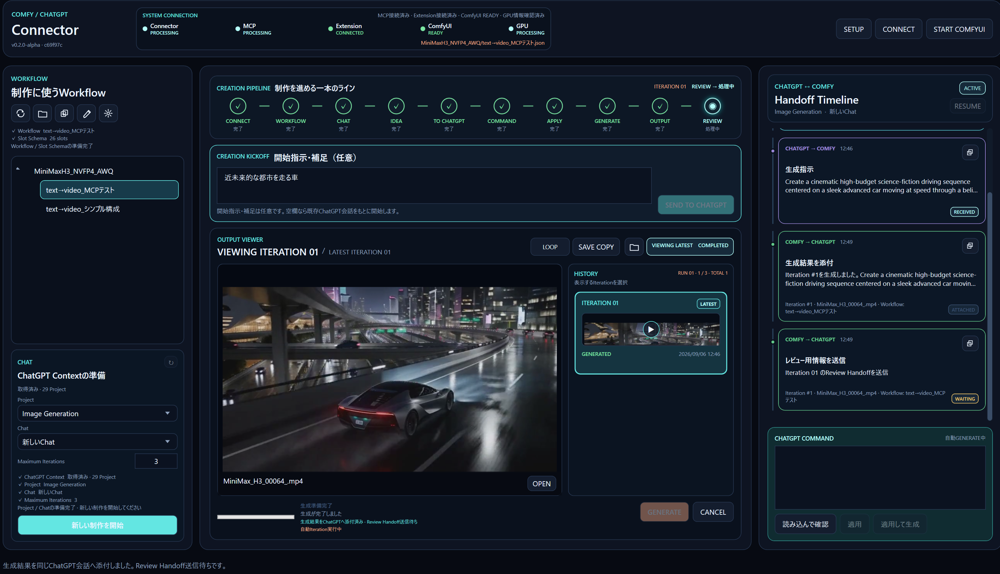](docs/images/manual/output-history.png)

<details>
<summary>履歴の表示・ラベルを読み解く</summary>

| 表示 | 意味 |
|---|---|
| VIEWING | 現在表示している反復 |
| LATEST | 最新の反復・結果 |
| FINAL | 制作完了時の最終結果 |
| GENERATED | 生成済み |
| LIMIT REACHED | 反復上限による停止 |
| CHATGPT COMPLETE | ChatGPTの判断で制作完了 |
| RUN / TOTAL | 現在のRunの進行と、制作全体の反復数 |

履歴を選んで表示しても、進行中の制作やChatGPTへの送信先は変わりません。動画がアプリ内で再生できない場合は、フォルダーや **OPEN** からファイルを開いて確認できます。

</details>

<a id="continue"></a>

## 4. 続行・停止・終了する

### 反復上限に達したとき

上限を超えて生成を続ける必要があると、**RESUME** と **この制作を終了** の選択が表示されます。

- **RESUME**：新しいRunとして続行します。保留中の生成指示がある場合は、その指示を実行します。
- **この制作を終了**：ここまでの結果を保持して制作を完了します。

RESUMEしても、過去の生成履歴は残ります。

[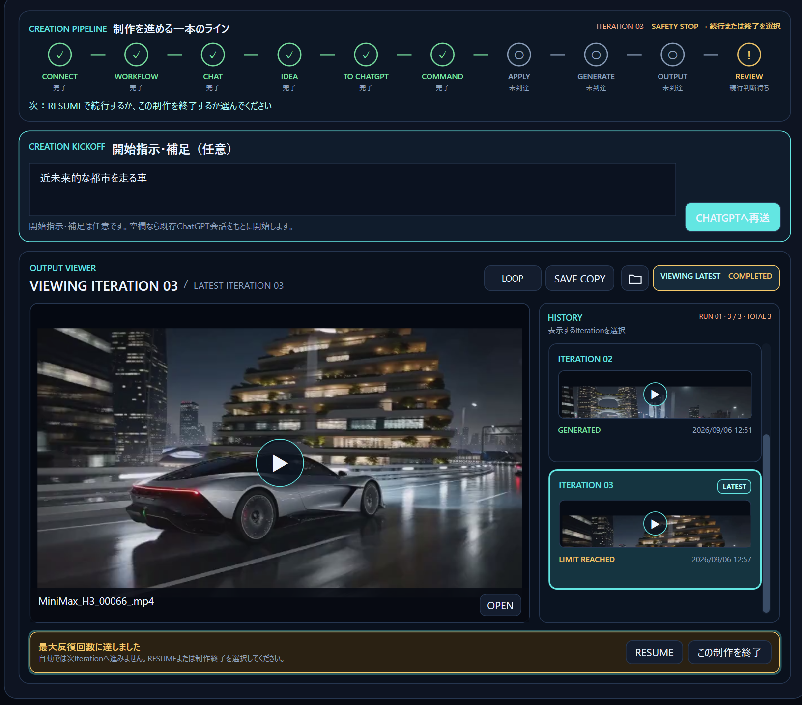](docs/images/manual/iteration-limit.png)

### 途中で止めたいとき

**CANCEL** が有効なときに押すと、Connectorが実行しているJobや自動継続の停止を要求します。状態表示で停止を確認してください。停止後に再開できる場合は、**RESUME** が使えます。

### 制作が完了したとき

ChatGPTが完了と判断すると、Sessionが完了状態になります。同じ制作をさらに進めたい場合は、右側の **RESUME** を使います。別の制作を始める場合は、左側で設定を確認して **新しい制作を開始** を押します。

### アプリを終了するとき

Connectorのウィンドウを閉じます。ComfyUI自体は終了しません。生成も止めてから終了したい場合は、先に **CANCEL** で停止を確認してください。

**現在の版では、再起動後の制作画面は空の状態から始まります。** 保存済みSessionの履歴はファイルに残りますが、過去のSessionを一覧から選んで復元する画面はまだありません。RESUMEは、現在の画面で扱っている制作に対して使います。

<a id="workflow"></a>

## 5. Workflowを確認・編集する

通常の制作では、ChatGPTの指示をConnectorが反映します。自分で確認・調整したい場合は、左のWorkflowを選んで設定アイコンを押してください。

<details>
<summary>Workflow一覧の操作</summary>

| アイコン・操作 | 用途 |
|---|---|
| ↻ | 一覧を更新する |
| フォルダー | Workflowの保存フォルダーを開く |
| 重なった書類 | 選択したWorkflowを複製する |
| 鉛筆 | 名前を変更する。Enterで確定、Escでキャンセル |
| 設定 | Workflowの編集画面を開く |

元のWorkflowを残して試したいときは、先に複製してから、その複製を選んで制作を開始します。

</details>

<details>
<summary>設定項目の変更・保存・バックアップの復元</summary>

Workflow設定画面では、主要・調整・詳細の項目を確認できます。表示される項目は、選んだWorkflowによって異なります。

1. 変更したい項目の値を編集します。
2. **SAVE** が有効になっている状態で押して保存します。
3. **VALIDATE** が有効な場合は、Workflowの検証に使えます。
4. 戻したい場合は、設定画面を下へスクロールし、**BACKUP / RESTORE** でバックアップの世代を選んで **RESTORE** を押します。

ボタンの有効・無効は現在の制作状態に応じて変わります。変更前にバックアップが作られ、直近3世代が保持されます。復元前にも、現在のWorkflowがバックアップされます。

外部でWorkflowを変更した場合は、Connectorで再読み込みしてから編集を続けてください。

<a href="docs/images/manual/workflow-settings.png">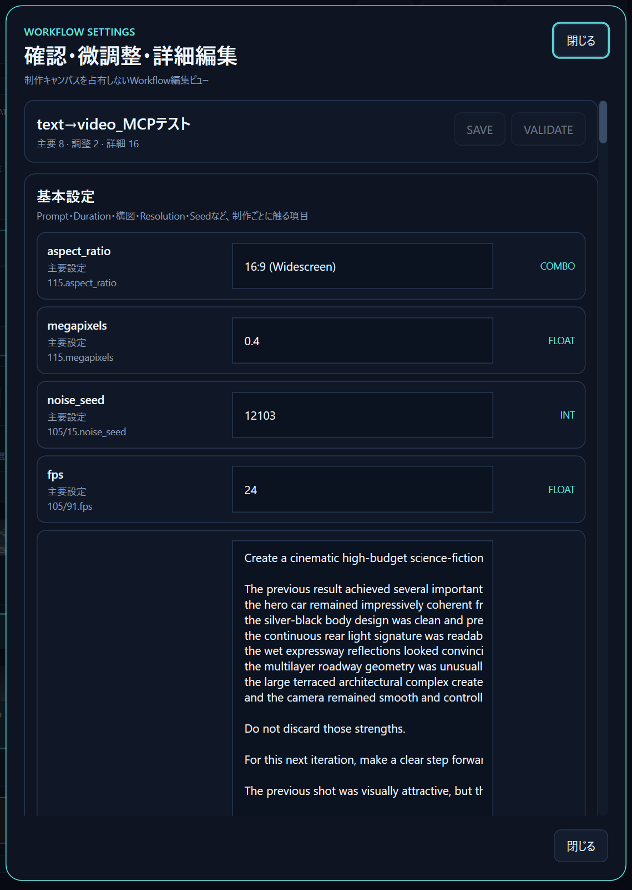</a>

</details>

<a id="help"></a>

## 6. 困ったとき

まず、パイプラインのエラー・待機理由と、画面下部のメッセージを確認します。

| 状況 | 最初に確認すること |
|---|---|
| CONNECTが完了しない | SETUPのPortableフォルダー、comfy-mcpの実行ファイル、Endpoint |
| Extensionが未接続 | Connectorが起動中か、拡張機能のペアリング・CONNECTの状態 |
| Workflowが表示されない | Workflowの保存場所と、一覧の↻ |
| Slot Schemaの取得に失敗した | MCP接続を確認し、Workflow設定画面のRETRY |
| Project / Chatを取得できない | ChatGPTへのログインとExtension接続を確認し、CHATの↻ |
| 新しい制作を開始できない | Workflow読込、Project / Chat、Maximum Iterationsの準備状況 |
| SEND TO CHATGPTが使えない | 制作を開始済みか、選択変更が未反映でないか、処理中でないか |
| ChatGPTへの送信に失敗した | 同じHandoffの「CHATGPTへ再送」、またはTimelineのコピー |
| 生成結果の添付に失敗した | Extension接続を確認し、「CHATGPTへ添付」で再試行 |
| ComfyUIの起動に失敗した | Portable内の`run_nvidia_gpu.bat`とEndpoint。必要ならComfyUIを手動起動 |
| 動画を再生できない | OPEN、または保存フォルダーから別のプレーヤーで確認 |

<details>
<summary>Project / Chatの取得が終わらない・取得エラーになる</summary>

1. ブラウザーでChatGPTにログインできていることを確認します。
2. Connector上部のExtensionが **CONNECTED** か確認します。
3. 取得中のウィンドウがログイン画面やエラー画面で止まっていないか確認します。
4. 状態を整えてから、CHATの **↻** で再取得します。

ChatGPT側の画面構成の変更などにより、取得できない場合もあります。起動直後に以前の一覧が表示されていても、最新の取得が完了したとは限らないため、「取得中」「取得済み」「取得エラー」の表示を確認してください。

</details>

<details>
<summary>自動送信に失敗した・手動でChatGPTへ渡したい</summary>

拡張機能が未接続の場合、**SEND TO CHATGPT** は制作情報をクリップボードへコピーします。使用するChatGPTの会話へ貼り付けて送信してください。

自動送信が失敗した場合は、中央の **CHATGPTへ再送** で同じHandoffを再試行できます。手動で渡す場合は、Handoff Timelineの該当カードにあるコピーアイコンを使います。拡張機能が未接続の再試行では、中央ボタンが **HANDOFFを再コピー** になります。

接続が戻っただけでは、失敗したHandoffを自動再送しません。送信済み・返答待ちなのか、再送が必要なのかをTimelineで確認してください。

| Timelineの表示 | 意味 |
|---|---|
| SENT | 送信済み |
| COPIED | クリップボードへコピー済み。ChatGPTへの貼り付けが必要 |
| RECEIVED | Responseを受信した |
| FAILED | 送信・処理に失敗した。表示された理由を確認する |

</details>

<details>
<summary>ChatGPTのResponseを手動で読み込みたい</summary>

1. 使用中のHandoffに対するChatGPTのResponseをコピーします。
2. 右下の **CHATGPT COMMAND** に、**Response全文**を貼り付けます。生成指示では`connector-command`と`COMFY_PAYLOAD`の両方を含めます。
3. **読み込んで確認**を押します。
4. 生成指示の検証が成功したら、**適用して生成**を押します。

**適用**だけを押した場合は、反映後に **GENERATE** で生成します。完了指示の場合は、検証された完了処理へ進みます。

古い制作のResponseや、別のHandoffに対する指示は受け付けられません。エラーになった場合は、現在の会話・Handoffに対応するResponseか確認してください。

[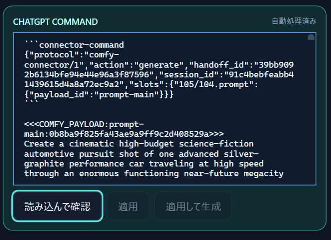](docs/images/manual/manual-response.png)

</details>

<details>
<summary>変更した画面や拡張機能が反映されない</summary>

- Connector本体を更新した場合は、起動中のConnectorを終了し、新しい実行ファイルから起動します。
- 拡張機能のファイルを更新した場合は、ブラウザーの拡張機能管理画面で、その拡張機能を再読み込みします。

ソースコードの編集やビルドだけでは、起動中のアプリは切り替わりません。

</details>

<details>
<summary>エラーの詳細を確認する・問題を報告する</summary>

**SETUP → ログフォルダを開く**からログを確認できます。問題を報告するときは、次の情報を添えると状況を確認しやすくなります。

- Connector左上のバージョンと短い識別番号。
- 実行した操作と、止まったパイプラインの段階。
- エラーメッセージ、またはその画面の写真。
- 該当時刻のログ。

共有する写真・ログには、ペアリングコードや公開したくない会話内容が含まれていないか確認してください。

</details>

<a id="storage"></a>

## 7. 保存場所とバックアップ

生成ファイルと、Connectorの設定・履歴は別の場所に保存されます。

| 保存するもの | 保存先 |
|---|---|
| 画像・動画の元ファイル | 設定したPortable内の`ComfyUI\output`以下。Workflowの出力設定に応じてサブフォルダーが作られる |
| SAVE COPYで保存したファイル | 保存ダイアログで指定した場所 |
| Connectorの設定・ペアリング情報 | Connector実行ファイルのあるフォルダーの`config` |
| 制作Session・履歴の情報 | 同じフォルダーの`data\sessions` |
| Workflowのバックアップ | 同じフォルダーの`backups` |
| ログ | 同じフォルダーの`logs` |
| Project / Chatなどのキャッシュ | 同じフォルダーの`cache` |

Connectorを移動・更新する前に、アプリを終了し、設定・履歴を含むフォルダーをバックアップしてください。生成した画像・動画を残すには、ComfyUI側の出力ファイルも保存します。

<a id="development"></a>

## 開発者向け情報

<details>
<summary>ソースコードからビルド・起動する</summary>

開発には.NET 10 SDKを使用します。リポジトリのルートで実行してください。

```powershell
dotnet restore ChatGPTComfyConnector.slnx
dotnet build ChatGPTComfyConnector.slnx --configuration Release
dotnet test ChatGPTComfyConnector.slnx --configuration Release
dotnet run --project src/ChatGPTComfyConnector.Desktop/ChatGPTComfyConnector.Desktop.csproj
```

通常のテストはGPU生成を開始しません。実機MCPへの接続を伴う検証は、`RUN_LIVE_MCP`や`RUN_LIVE_WORKFLOW`を明示的に有効にした場合に限ります。詳細は[テスト](tests/ChatGPTComfyConnector.Tests)を参照してください。

</details>

<details>
<summary>本体とコレクタの配布ZIPを作る</summary>

PowerShell 7で、必要なコンポーネントのコマンドを実行します。本体の作成には.NET 10 SDKを使用します。

```powershell
.\scripts\publish-win-x64.ps1 -Version '0.2.0-alpha'
.\scripts\publish-collector.ps1 -Version '0.2.0'
```

| 作成対象 | 出力先 |
|---|---|
| 本体 | `artifacts/desktop/ChatGPT-Comfy-Connector-v…-win-x64.zip` |
| コレクタ | `artifacts/collector/ChatGPT-Comfy-Collector-v….zip` |

それぞれZIP、`.zip.sha256`、公開文の`.release-notes.md`を作成します。`-OutputDirectory`で出力先を変更できます。同じバージョンの成果物は再作成時に更新されます。

`-Version`は配布物のバージョンにも反映します。本体は.NETのバージョン、コレクタはZIP内の`manifest.json`の`version`と`version_name`に設定します。例えば`0.2.0-alpha`は、manifestでは`version: 0.2.0`、`version_name: 0.2.0-alpha`になります。ソースファイルは書き換えません。

ローカルでの確認コマンド：

```powershell
.\tests\distribution\release-scripts.tests.ps1
node --test tests/browser-extension/background.test.mjs tests/browser-extension/content-script.test.mjs tests/browser-extension/chatgpt-context.test.mjs
```

コレクタのテストにはNode.js 24を使用します。ZIP作成スクリプトはローカルの成果物を作成します。

</details>

<details>
<summary>GitHub Releasesへ公開する</summary>

公開する変更をコミット・pushした後、対象コンポーネントのタグを作成してpushします。本体とコレクタのバージョンは個別に進められます。

| 対象 | タグの例 | 起動するワークフロー |
|---|---|---|
| 本体 | `desktop-v0.2.0-alpha` | [Release Desktop](.github/workflows/release-desktop.yml) |
| コレクタ | `collector-v0.2.0` | [Release Collector](.github/workflows/release-collector.yml) |

本体の公開例：

```powershell
git tag desktop-v0.2.0-alpha
git push origin desktop-v0.2.0-alpha
```

コレクタの公開例：

```powershell
git tag collector-v0.2.0
git push origin collector-v0.2.0
```

タグは`desktop-v`または`collector-v`にSemVerを続けます。`-alpha`、`-beta`、`-rc.1`などのプレリリース識別子がある場合は、GitHubでもPre-releaseになります。

各ワークフローは対象のテストを実行し、ZIPとSHA-256を作成します。新しいリリースは下書きで作成し、両ファイルの添付が完了してから公開します。コレクタの公開では、リポジトリのLatest表示を変更しません。

同じタグのワークフローを再実行すると、そのリリースの配布ファイルを更新します。公開にはGitHub Actionsの`GITHUB_TOKEN`を使い、ワークフローの`contents: write`権限で処理します。

</details>

<details>
<summary>設計・通信仕様を読む</summary>

- [アーキテクチャ](docs/architecture.md)：制作状態、保存、実行手順、操作案内の設計。
- [Connector Protocol v1](docs/connector-protocol-v1.md)：HandoffとResponseの形式。
- [Browser Extension Bridge](docs/browser-extension-bridge.md)：拡張機能の接続・通信仕様。
- [リリース設計](docs/releases.md)：タグ、配布物のバージョン、パッケージ作成・公開の流れ。
- [拡張機能README](browser-extension/README.md)：ブラウザー側の構成。

</details>
